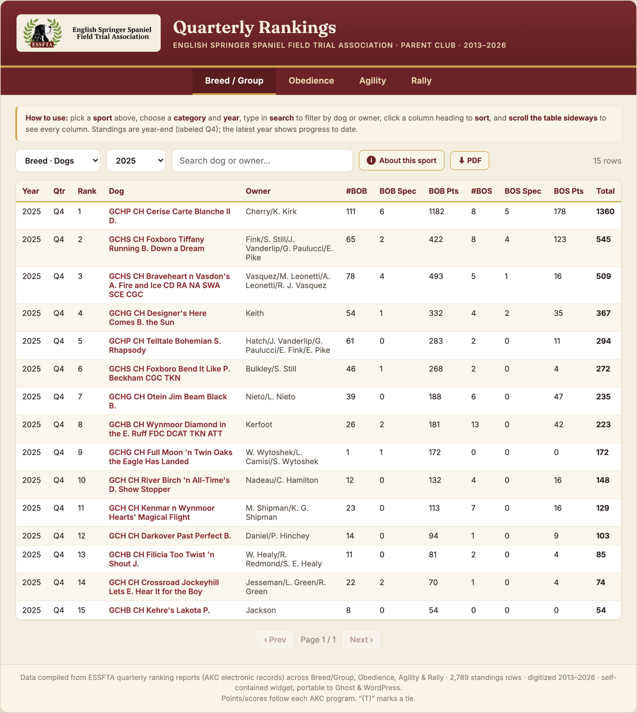
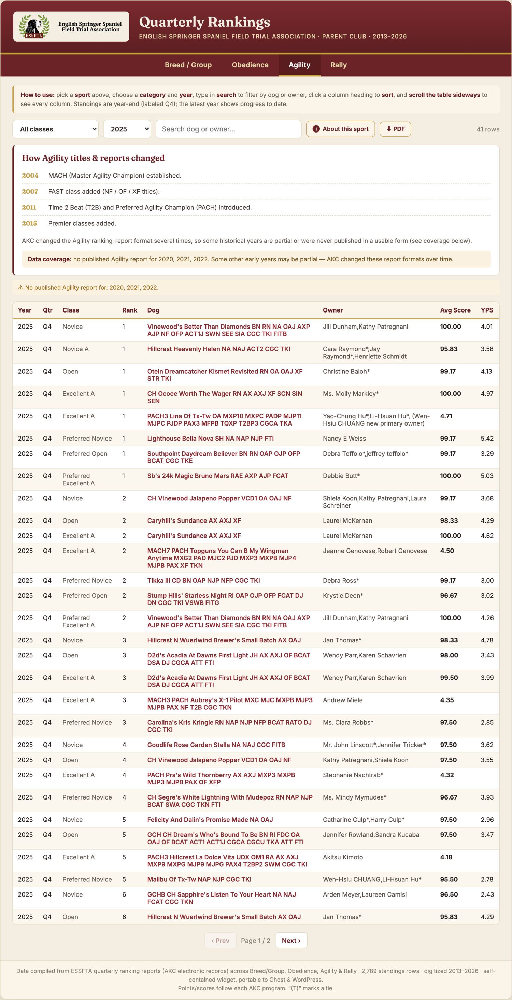
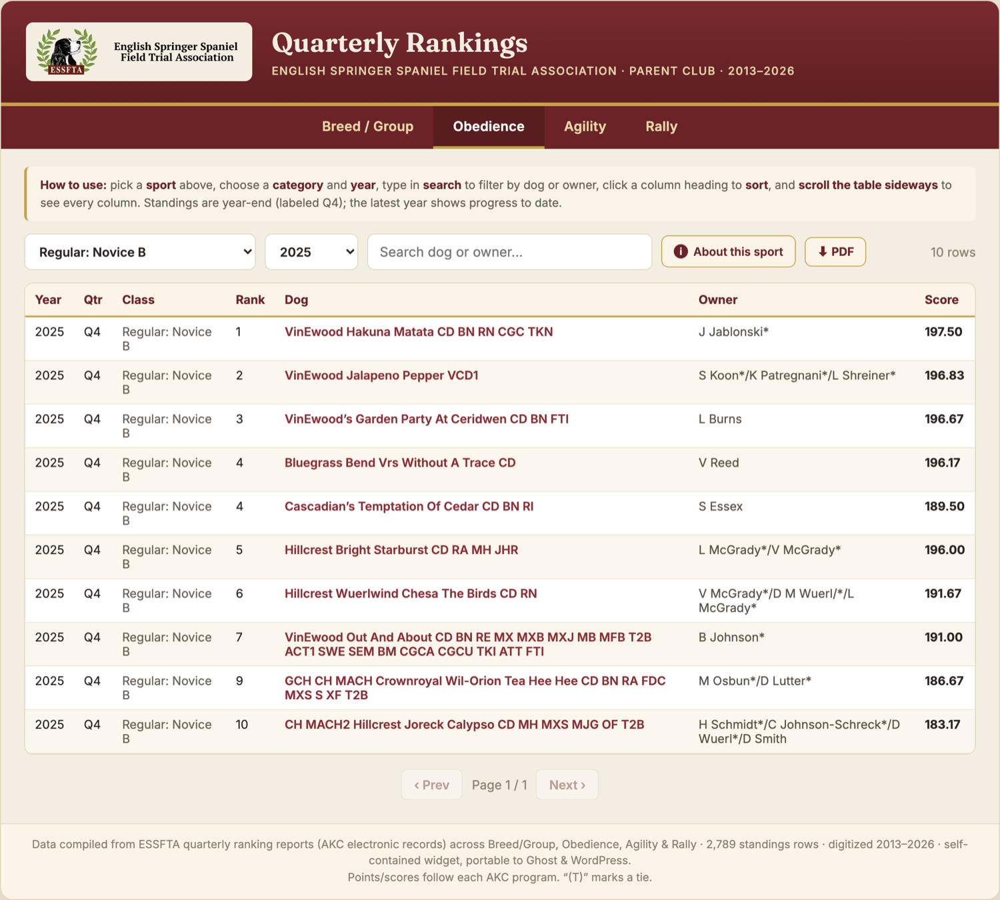
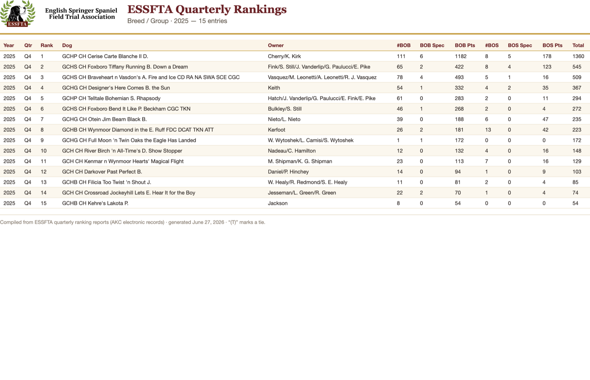

# ESSFTA Quarterly Rankings

Digitizes the English Springer Spaniel Field Trial Association (ESSFTA) parent-club
**quarterly ranking reports** — published as inconsistent PDFs — into clean,
structured data (CSV / JSON / SQLite) and a self-contained, embeddable web widget
with top-level tabs by sport: **Breed/Group · Obedience · Agility · Rally**.

Source reports: https://englishspringerspaniels.org/faq-items/quarterly-rankings/

## Screenshots

| Breed/Group rankings | Per-sport title/class explainer + data-coverage |
|---|---|
|  |  |

| Obedience (sport-specific columns) | One-click PDF export of the current view |
|---|---|
|  |  |

## What's here

| File | Purpose |
|---|---|
| `parse.py` | Parse the conformation (Breed/Group) PDFs → `breed_group.csv/.json` |
| `parse_sports.py` | Parse the Obedience/Agility/Rally PDFs → `sports.csv/.json` |
| `titlecase.py` | Title-Case dog/owner names while keeping AKC titles + roman numerals uppercase |
| `dataprep.py` | Shared loader: applies title-casing + small fixes; sport names left as-is |
| `build_db.py` | Build `essfta_rankings.db` (SQLite: `conformation` + `sports` tables, `rankings` view) |
| `build_widget.py` | Build `quarterly_rankings_widget.html` (the embeddable widget) |
| `recon.py` | Reconciliation: compare parsed rows vs. source PDFs to find gaps/dropped rows |
| `sports_manifest.json` | List of sport PDFs (year, sport, quarter, source URL) |
| `pdfs/` | The downloaded source report PDFs |
| `essfta-logo.png` | Club logo used in the widget header |

## Pipeline (run order)

```bash
python3 parse.py          # conformation PDFs  -> breed_group.csv/.json
python3 parse_sports.py   # sport PDFs         -> sports.csv/.json
python3 build_db.py       # -> essfta_rankings.db
python3 build_widget.py   # -> quarterly_rankings_widget.html
python3 recon.py          # optional: data-completeness audit
```

Requires Python 3 with `pdfplumber`, plus the `pdftotext` CLI (poppler).

## Adding a new quarterly report

1. Download the new PDF into `pdfs/`, named `YYYY-<Sport>-Q#.pdf`
   (e.g. `2026-Obedience-Q2.pdf`; `<Sport>` = `Conformation`/`Obedience`/`Agility`/`Rally`).
2. For a sport PDF, add an entry to `sports_manifest.json`.
3. Re-run the pipeline above. Run `recon.py` to confirm rows weren't dropped.
4. Re-embed the regenerated `quarterly_rankings_widget.html` on the website (it's a
   single self-contained HTML string — paste into any CMS HTML embed/card).

## Why the PDFs are inconsistent (important for the next volunteer)

The reports were produced by different people/tools over 2013–2026, so layouts vary:

- **Conformation** uses two layout generations (2013–2019 vs. 2020+) and a bordered-table
  layout (2026+). `parse.py` reads column x-positions live per page rather than hardcoding.
- **Obedience / Rally** are mostly clean. Two wrinkles handled in `parse_sports.py`:
  a *score-second* layout (2024 Rally: `Rank Score Dog Owner`) and a *parenthesised-rank*
  layout (2023 Rally: `(1) Dog …`). Long names that collapse the column spacing are
  recovered by reading word x-positions instead of whitespace gaps.
- **Agility is the hard one** — it uses ~3 incompatible column orders
  (`Name|Owner|Avg|YPS`, `Name|Avg|YPS|Owner`, plus two-owner variants) and a separate
  "Springer of the Year" total-points section. `parse_sports.py` runs two parsers and
  keeps whichever recovers more valid rows per PDF. Some early years are partial, and
  **no Agility report was published for 2020–2022**. The widget flags missing years.

## AKC title & class timeline (why categories/titles differ by year)

Titles and classes changed over time, which explains year-to-year differences:

- **Breed/Group:** Grand Champion (GCH) introduced **2010**; tiers Bronze/Silver/Gold/Platinum
  (GCHB/GCHS/GCHG/GCHP) added **2011**.
- **Obedience:** Beginner Novice (BN) **2010**; Graduate Novice/Open (GN/GO) and Preferred
  classes **2011**.
- **Agility:** MACH **2004**; FAST class (NF/OF/XF) **2007**; Time 2 Beat (T2B) and Preferred
  Agility Champion (PACH) **2011**; Premier classes **2015**.
- **Rally:** began **2005** with RAE as the top title; the **Nov 2017** revamp added
  RACH (Rally Champion) plus the Master and Intermediate (RI) classes — so those only
  appear from 2017 on.

## Data schema

- **conformation**: `year, quarter, section, rank, tie, name, owner` + point columns
  (Breed: `bob_*`/`bos_*`/`total`; Group: `bis_*`/`grp1..4_*`/`total`).
- **sports**: `sport, year, quarter, category, rank, tie, dog, owner, score, score2`
  (Agility uses `score`=Avg Score, `score2`=YPS).
- **rankings** (SQLite view): unified `sport, year, quarter, category, rank, tie, name, owner, score`.

`(T)` / `tie` marks dogs tied at the same rank.

## License / data

Ranking data is compiled from ESSFTA's publicly published reports (AKC electronic records).
This repository is for preservation and to let club volunteers maintain the pipeline.
